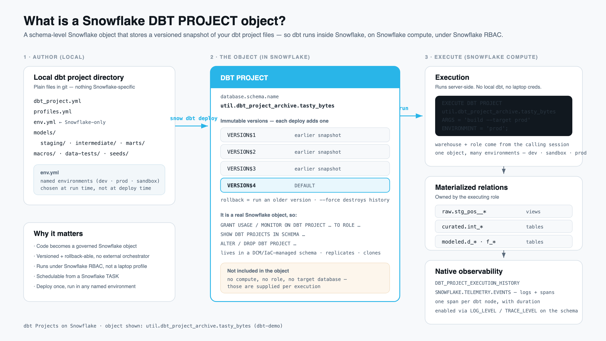

# Developer Loop

How the same models in this repo get built in three different places.

The models, tests, and macros never change between stages. What changes is
*where dbt runs*, *which credentials it uses*, and *which database the output
lands in*. That is the whole idea: promote the code, not a rewrite of it.

## Sections

- [The three stages](#the-three-stages)
- [Your sandbox comes first](#your-sandbox-comes-first)
  - [What demo-up-pdb creates](#what-demo-up-pdb-creates)
  - [Why a database and not a schema](#why-a-database-and-not-a-schema)
  - [Tear it down](#tear-it-down)
- [Stage 1 - Run dbt locally](#stage-1---run-dbt-locally)
  - [Why start here](#why-start-here)
  - [Prerequisites](#prerequisites)
  - [Build the marts](#build-the-marts)
  - [What that selector actually builds](#what-that-selector-actually-builds)
  - [Where the models land](#where-the-models-land)
  - [The tighter inner loop](#the-tighter-inner-loop)
  - [Verify the build](#verify-the-build)
  - [Troubleshooting: insufficient privileges to operate on view](#troubleshooting-insufficient-privileges-to-operate-on-view)
  - [The limitation of this stage](#the-limitation-of-this-stage)
- [Stage 2 - Run dbt inside Snowflake](#stage-2---run-dbt-inside-snowflake)
  - [Why bother, when stage 1 already works](#why-bother-when-stage-1-already-works)
  - [The profile file has a Snowflake-specific name](#the-profile-file-has-a-snowflake-specific-name)
  - [env.yml is where the environments live](#envyml-is-where-the-environments-live)
  - [Running from CoCo Desktop or Workspaces](#running-from-coco-desktop-or-workspaces)
  - [The three grants a sandbox role needs](#the-three-grants-a-sandbox-role-needs)
  - [dbt deps needs an external access integration](#dbt-deps-needs-an-external-access-integration)
  - [The two-role model](#the-two-role-model)
  - [What isolation does not cover](#what-isolation-does-not-cover)
  - [A note on who can see what](#a-note-on-who-can-see-what)
  - [Observability](#observability)
- [Stage 3 - CI and CD with GitHub Actions](#stage-3---ci-and-cd-with-github-actions)
  - [One-time account setup](#one-time-account-setup)
  - [On a pull request](#on-a-pull-request)
  - [On a merge to main](#on-a-merge-to-main)
  - [When the PR closes](#when-the-pr-closes)
  - [Why --default-env prod is on the deploy step](#why---default-env-prod-is-on-the-deploy-step)
  - [Why the facts are excluded everywhere](#why-the-facts-are-excluded-everywhere)

## The three stages

| | Stage 1 - Local | Stage 2 - dbt Projects on Snowflake | Stage 3 - GitHub Actions |
| --- | --- | --- | --- |
| dbt executes on | your laptop | Snowflake | a CI runner, driving Snowflake |
| Credentials | a target in `~/.dbt/profiles.yml` | none in the project: the session that runs the project object | OIDC, no stored secret |
| Code source | your working tree, committed or not | a versioned `DBT PROJECT` object | the PR head, then the merge commit |
| Writes to | `dbt_pdb_<user>` | `dbt_pdb_<user>` | a per-PR clone of `dbt_prod`, then `dbt_prod` |
| Entrypoint | `task dbt:build-dimensions` | CoCo Desktop / Workspaces, or `snow dbt execute` | `git push` |

Each stage trades feedback speed for reproducibility. Stage 1 will run code you
have not committed, which is exactly what you want while iterating and exactly
what you do not want in production.

## Your sandbox comes first

Stages 1 and 2 both build into a personal sandbox database, so create one before
anything else. Set your name in `.env/demo.env`:

```shell
DBT_PDB_USERNAME=DGILLIS
```

then:

```shell
task demo-up-pdb
```

The value is validated by a Task precondition (`^[A-Za-z_][A-Za-z0-9_]*$`) rather
than being derived from `CURRENT_USER()`. That is deliberate: the sandbox you want
to operate on is not necessarily the one owned by whoever the connection happens
to authenticate as, and an explicit variable is greppable in a way a query result
is not.

### What demo-up-pdb creates

Four steps, in order:

1. **Bootstrap** - `sql/bootstrap/001-create_util_database.sql` creates the shared
   `util` database with `dcm_project_archive` (DCM project objects) and
   `dbt_project_archive` (`DBT PROJECT` objects), sets the three telemetry levels
   on the latter, and enables `FEATURE_RBAC_INHERITED_GRANTS`.
2. **DCM deploy** - target `DBT_PDB_DGILLIS` in `tasks/snow-cli/dcm/manifest.yml`,
   with `base` overridden at run time to `dbt_pdb_<DBT_PDB_USERNAME>`. Creates the
   database and its `raw`, `curated`, `modeled`, `utilities` schemas, six
   warehouses (`_xs_wh` through `_xxl_wh`), four roles (`_rw`, `_ro`,
   `_data_engineer`, `_analyst`), the two surrogate-key UDFs in `utilities`, and
   the grants.
3. **Seed** - `sql/seed/001-load_raw_source_tables.sql` `COPY INTO`s the nine raw
   source tables from the public Tasty Bytes S3 bucket, but only those that are
   empty. Roughly 921M rows on the XL warehouse; the two order tables are the
   bulk of it.
4. **Grants** - `sql/dbt-project-grants/` gives `<base>_data_engineer` what it
   needs to run the deployed `DBT PROJECT` object and to fetch dbt packages. See
   [stage 2](#the-three-grants-a-sandbox-role-needs).

Ownership is not incidental. `grants.sql` transfers `OWNERSHIP` of the four
schemas and the nine raw tables to `<base>_rw`, and `<base>_data_engineer`
inherits `_rw`, so everything dbt later builds is owned by a role in the same
hierarchy. Data access uses `GRANT INHERITED`, a container-level rule, rather
than per-object grants.

Step 4 has a hard dependency worth knowing about: it grants `USAGE` on the
account-level `dbt_deps_ext_access` integration, which is created by
`task demo-up-prod`. On an account with no prod deployment, `demo-up-pdb` fails
there.

### Why a database and not a schema

An earlier version of this project isolated developers by *schema* inside one
shared `dev_dbt_demo` database, deriving the schema name from `CURRENT_USER()`.
Isolating by database instead buys three things:

- The raw sources are yours, so you can reload or truncate them without affecting
  anyone.
- The `raw` / `curated` / `modeled` layering survives. Under schema-based
  isolation every layer had to collapse into the one developer schema, or the
  staging views would land back in the shared `raw` and defeat the point.
- The whole sandbox is one DCM target, so `task demo-teardown-pdb` removes it
  exactly and provably.

`macros/generate_schema_name.sql` still carries the collapse branch for
schema-isolated environments, but the `dbt_pdb` sandbox does not take it: it pins
`DBT_CURRENT_SCHEMA` to `modeled` and takes the shared path.

### Tear it down

```shell
task demo-teardown-pdb
```

`snow dcm purge` drops every object the project owns, then `snow dcm drop`
removes the registration. Purge is driven by the project's own recorded state,
not by re-rendering the definitions, so it cannot drift from what was deployed
and it cannot reach another developer's sandbox or prod.

## Stage 1 - Run dbt locally

### Why start here

Fastest possible loop. dbt parses your working tree directly, so an edit is one
`task` invocation away from being materialized in Snowflake. Nothing is staged,
uploaded, or versioned, and there is no deploy step to wait on.

The cost is that this stage is unreproducible by anyone else: it runs whatever
is currently on your disk, under your personal credentials, using whatever dbt
you happen to have installed.

### Prerequisites

**1. Activate the virtual environment.** dbt is installed there, not globally.

```shell
source ./.venv/bin/activate
```

**2. Have a credentialed target in `~/.dbt/profiles.yml`** pointing at your
sandbox. Its `database`, `role`, and `warehouse` must all name the same
`dbt_pdb_<user>` base, because the sandbox roles hold nothing on any other
database:

```yaml
default:
  outputs:
    dbt-pdb:
      type: snowflake
      account: sfsenorthamerica-dgillis_aws_useast1_v1
      user: dgillis
      role: dbt_pdb_dgillis_data_engineer
      database: dbt_pdb_dgillis
      warehouse: dbt_pdb_dgillis_s_wh
      schema: modeled
      threads: 8
      private_key_path: /Users/dgillis/.ssh/demo_dgillis_keypair_auth_rsa_key.p8
```

A mismatch here produces a misleading error. `002043 (02000): Object does not
exist, or operation cannot be performed` on `show terse schemas in database
dbt_pdb_dgillis` is Snowflake's response to *insufficient privileges*, not to a
missing database - the usual cause is a target still naming an old role or
warehouse.

**3. Name the target in `.env/demo.env`.** Every local task reads
`DBT_LOCAL_TARGET` and refuses to run without it:

```shell
DBT_LOCAL_TARGET=dbt-pdb
```

Override it per run rather than editing the file when you need a different one:

```shell
DBT_LOCAL_TARGET=dbt-pdb-pat task dbt:build-dimensions
```

**4. Mint a PAT, if your target uses PAT authentication** rather than a key pair.
`task pat-create` mints a token, pins it to a role, and writes the
`export DBT_ENV_SECRET_PAT=...` line into your `~/.zshrc`, replacing any previous
one. Its defaults target the `tastyb` service user, so pass your own:

```shell
task pat-create PAT_USER=tastyb \
                PAT_NAME=dbt_pdb_dgillis_pat \
                PAT_ROLE_RESTRICTION=dbt_pdb_dgillis_data_engineer
```

Reference it from the profile rather than pasting the secret in:

```yaml
      password: "{{ env_var('DBT_ENV_SECRET_PAT') }}"
```

The `DBT_ENV_SECRET_` prefix is what makes dbt mask the value in its logs. Two
things about PATs are worth remembering: `ROLE_RESTRICTION` is matched
case-sensitively against the stored role name, and a PAT can never assume any
other role, so the restricted role must be the one in the profile. The task
prints a reminder that the *current* shell still holds the old token - open a new
shell or `source ~/.zshrc`.

**5. Confirm dbt can connect.**

```shell
task dbt:debug
```

> **Why `--profiles-dir ~/.dbt` is passed explicitly.** Every task in
> `tasks/dbt/dbt-tasks.yml` passes it. The project root holds a credential-free
> profile for stage 2, and it is deliberately named
> `dbt_projects_profiles.yml` - a name local dbt ignores - so it can no longer
> shadow your real one. The flag is now belt and braces rather than load-bearing,
> and it also documents which file a run used.

### Build the marts

```shell
task dbt:build-dimensions
```

Under the hood:

```shell
dbt build --target "$DBT_LOCAL_TARGET" --project-dir . --profiles-dir ~/.dbt \
  --select +path:models/marts --exclude f_order f_order_line
```

That is the same selection stages 2 and 3 run, so what you validate locally is
what CI validates.

### What that selector actually builds

`+path:models/marts` selects everything in `models/marts` **plus all upstream
ancestors**, which is what pulls in the staging views and the intermediate
model without naming them.

The two fact tables are excluded on purpose: `f_order` is built on 248M rows and
`f_order_line` on 673M. They need a larger warehouse and are not part of the
demo loop.

That leaves 17 models and 12 tests, which dbt reports as
`PASS=29 WARN=0 ERROR=0 SKIP=0 TOTAL=29`:

| Layer | Models | Nodes |
| --- | --- | --- |
| `models/marts` | 8 dimensions | `d_country`, `d_franchise`, `d_location`, `d_loyalty_member`, `d_menu_item`, `d_menu_item_ingredients`, `d_menu_type`, `d_truck` |
| `models/intermediate` | 1 table | `int_franchise_deduped` |
| `models/staging` | 8 views | `stg_loyalty__customer_loyalty`, `stg_pos__country`, `stg_pos__franchise`, `stg_pos__location`, `stg_pos__menu`, `stg_pos__order_detail`, `stg_pos__order_header`, `stg_pos__truck` |

`stg_safegraph__core_poi_geometry` is absent because no mart references it, so
it is not an ancestor of anything selected. Note that `dbt ls --resource-type
test` reports 14 tests while `dbt build` runs 12; trust the build.

To see the model list yourself without building anything:

```shell
dbt ls --target "$DBT_LOCAL_TARGET" --profiles-dir ~/.dbt \
  --select +path:models/marts --exclude f_order f_order_line --resource-type model
```

### Where the models land

Each layer is routed to a fixed schema by `dbt_project.yml`, all inside your
sandbox database:

| Layer | `dbt_project.yml` config | Resolved schema | Materialization |
| --- | --- | --- | --- |
| `staging` | `+schema: raw` | `dbt_pdb_<user>.raw` | view |
| `intermediate` | `+schema: curated` | `dbt_pdb_<user>.curated` | table |
| `marts` | *(none)* | `dbt_pdb_<user>.modeled` | table |

`marts` sets no `+schema`, so it falls through to the target's own schema,
`modeled`. The staging views land in `raw` *beside* the nine source tables they
read - `+schema: raw` resolves to the literal `raw` only because
`macros/generate_schema_name.sql` overrides dbt's default, which would otherwise
have produced `modeled_raw`.

One mart overrides its materialization in the model file itself:
`d_loyalty_member` is `incremental` on `unique_key='customer_id'`, so a rebuild
merges rather than replaces. Its watermark is `last_update_ts`, which the seed
synthesizes with `CURRENT_TIMESTAMP()` because the public S3 CSV does not carry
it. If that column were ever NULL the incremental predicate would match nothing
and the model would silently build zero rows.

### The tighter inner loop

Building 17 models to check one change is wasteful. When you are iterating on a
single dimension, select just it and its ancestors:

```shell
task dbt:build-country-dimension
```

which is:

```shell
dbt build --target "$DBT_LOCAL_TARGET" --project-dir . --profiles-dir ~/.dbt --select +d_country
```

Use the same `+model_name` shape for any other model, for example
`--select +d_franchise` to pick up `int_franchise_deduped` and
`stg_pos__franchise` along the way.

### Verify the build

dbt reports pass/fail per node, but it is worth confirming the objects landed
in the schemas the table above predicts, and that they are owned by the role you
built with:

```sql
SELECT table_schema, table_type, table_owner, count(*) AS objects
FROM dbt_pdb_dgillis.information_schema.tables
WHERE table_schema IN ('RAW', 'CURATED', 'MODELED')
GROUP BY 1, 2, 3
ORDER BY 1, 2, 3;
```

Expect views in `RAW` (the staging layer), one table in `CURATED`
(`int_franchise_deduped`), and the dimension tables in `MODELED`. Everything dbt
created should be owned by `DBT_PDB_DGILLIS_DATA_ENGINEER`; the nine base tables
in `RAW` are DCM-managed and owned by `DBT_PDB_DGILLIS_RW`, which
`_data_engineer` inherits.

Row counts worth spot-checking, because two of them are not one-to-one:

```text
raw.country     30   ->  stg_pos__country     30  ->  d_country    30
raw.franchise  335   ->  int_franchise_deduped 325 ->  d_franchise 325
```

`raw.franchise` holds 335 rows over 325 distinct `franchise_id` in two different
shapes. Ids 332-336 are byte-identical duplicate rows; ids 36, 37, 49, 81, and
123 are multi-city franchisees where only `city` differs. `d_franchise` keys on
`franchise_id` alone and `schema.yml` declares that unique, so
`int_franchise_deduped` regrains to one row per id with
`row_number() over (partition by franchise_id order by city) = 1`, deliberately
dropping the second city. A plain `DISTINCT` would only fix the first shape and
leave the unique test failing.

### Troubleshooting: insufficient privileges to operate on view

```text
003001 (42501): SQL access control error:
Insufficient privileges to operate on view 'STG_POS__FRANCHISE'.
Your primary role DBT_PDB_DGILLIS_DATA_ENGINEER must have OWNERSHIP
granted on TABLE DBT_PDB_DGILLIS.RAW.STG_POS__FRANCHISE.
```

dbt materializes tables and views with `CREATE OR REPLACE`, and that requires
**OWNERSHIP** of the existing object, not merely write privileges. Ownership in
Snowflake follows the creating role. So this error means the object was created
by a *different* role than the one you are now building with - typically a run
whose role was not pinned, or a run made as `ACCOUNTADMIN` before the sandbox
existed.

Repair it by transferring ownership of the dbt-built objects, leaving the
DCM-managed source tables alone:

```sql
GRANT OWNERSHIP ON ALL VIEWS  IN SCHEMA dbt_pdb_dgillis.raw
  TO ROLE dbt_pdb_dgillis_data_engineer COPY CURRENT GRANTS;
GRANT OWNERSHIP ON ALL TABLES IN SCHEMA dbt_pdb_dgillis.curated
  TO ROLE dbt_pdb_dgillis_data_engineer COPY CURRENT GRANTS;
GRANT OWNERSHIP ON ALL TABLES IN SCHEMA dbt_pdb_dgillis.modeled
  TO ROLE dbt_pdb_dgillis_data_engineer COPY CURRENT GRANTS;
```

`COPY CURRENT GRANTS` preserves the existing grants instead of revoking them.
Note the first statement targets `ALL VIEWS`, not `ALL TABLES`: the staging views
in `raw` are dbt's, while the base tables beside them belong to DCM and must keep
their owner.

Because a sandbox is disposable, `task demo-teardown-pdb` followed by
`task demo-up-pdb` is also a legitimate fix, at the cost of reseeding.

### The limitation of this stage

A per-developer database removes the collision problem, but not the
reproducibility one. This stage still runs *your working tree* on *your dbt
install*, under credentials on your disk:

- Nobody else can reproduce a run, because the input is uncommitted files.
- Your dbt version is whatever you `pip install`ed, and it has to be kept in step
  with the Snowflake runtime by hand.
- The credentials are local. A leaked key or PAT is a real key or PAT.

Stage 2 fixes all three by making the code a Snowflake object.

## Stage 2 - Run dbt inside Snowflake

In this stage the project is deployed into Snowflake as a `DBT PROJECT` object
and dbt runs *there*. Snowflake owns the runtime, the dbt version, and the
orchestration, so there is no Python environment to maintain and no dbt CLI
version drift between developers.



Snowflake's [best practices for dbt Projects on
Snowflake](https://docs.snowflake.com/en/user-guide/data-engineering/dbt-projects-on-snowflake-best-practices)
sanctions deploying and testing this way for **dev and staging** targets.
Production is deliberately different and belongs in stage 3: deploying straight
to a production project object, whether from the Git stage or by pulling into
Workspaces and clicking deploy, is called out there as an anti-pattern because
nothing gates the change behind tests and review.

That is why this repo has **no `task` that deploys the project object**. The
production object `util.dbt_project_archive.tasty_bytes` is deployed only by
`merge_main.yml`, and per-PR tester objects only by `incoming_pr.yml`. Locally
you *run* an existing object; you do not create one.

### Why bother, when stage 1 already works

| | Stage 1 (local) | Stage 2 (in Snowflake) |
| --- | --- | --- |
| dbt install | yours, and yours alone | Snowflake-managed, identical for everyone |
| dbt version | whatever you `pip install`ed | pinned on the object (1.11.11 here) |
| Credentials | a PAT or key pair on your disk | none stored; runs as the calling session |
| Reproducible by a teammate | no, it is your working tree | yes, it is a numbered version |
| Rollback | `git checkout`, then rebuild | run an earlier `VERSION$n` |

### The profile file has a Snowflake-specific name

The profile in the project root is `dbt_projects_profiles.yml`, not
`profiles.yml`. Snowflake accepts either, and prefers the former when both are
present - which is exactly the point, because local dbt does not recognise that
name at all. One file per purpose, no shadowing.

```yaml
default:
  target: prod
  outputs:
    prod:
      type: snowflake
      account: "not needed"
      user: "not needed"
      role: "{{ env_var('DBT_CURRENT_ROLE') }}"
      database: "{{ env_var('DBT_CURRENT_DB') }}"
      schema: "{{ env_var('DBT_CURRENT_SCHEMA') }}"
      warehouse: "{{ env_var('DBT_CURRENT_WH') }}"
      threads: 8
```

`account` and `user` are placeholders that Snowflake never reads: the run already
has a session. There is exactly one target, and every value that matters comes
from `env.yml`. `threads: 8` is Snowflake's recommendation for compatibility
across warehouse sizes.

### env.yml is where the environments live

`env.yml` defines three environments. Snowflake resolves it *before* dbt starts
and injects the results as environment variables, which is why the values can be
live SQL.

| Environment | `DBT_CURRENT_DB` | Schema | Warehouse | Role |
| --- | --- | --- | --- | --- |
| `dbt_pdb` *(default)* | `'dbt_pdb_' \|\| CURRENT_USER()` | `modeled` | `CURRENT_WAREHOUSE()` | `CURRENT_ROLE()` |
| `prod` | `dbt_prod` | `modeled` | `dbt_prod_s_wh` | `dbt_prod_data_engineer` |
| `ci` | *(a name that does not exist)* | `modeled` | `dbt_prod_s_wh` | `dbt_prod_data_engineer` |

`dbt_pdb` is the interactive environment, and it takes everything from the
session: run it as yourself and it builds into your sandbox with no
configuration. `prod` is fully literal, because a deploy-time compile and a
scheduled task both need values that resolve identically no matter who or what
triggers them.

`ci` is the interesting one. Its `DBT_CURRENT_DB` is deliberately
`xx_dbt_ci_db_override_not_supplied`, a database that does not exist, so a CI run
that forgets to pass `--env-vars` fails immediately and loudly rather than
building somewhere real. The per-PR clone name is supplied at run time, which is
the highest tier of value precedence.

Environment selection has its own precedence, highest first:
`ENVIRONMENT = '...'` on `EXECUTE DBT PROJECT` (or `--env`), then
`DEFAULT_ENVIRONMENT` on the object, then `default_environment` in `env.yml`.

### Running from CoCo Desktop or Workspaces

Because `dbt_pdb` resolves the database, warehouse, and role from the session,
the natural place to run stage 2 is somewhere that already has a session as you:
CoCo Desktop in Snowflake-managed mode, or a Snowflake Workspace. Pick the
environment in the run panel, pick `dbt_deps_ext_access` as the external access
integration, and run.

The equivalent from a terminal, if you would rather not leave it:

```shell
snow dbt execute \
  --env dbt_pdb \
  --dbt-version 1.11.11 \
  util.dbt_project_archive.tasty_bytes build \
  --select +path:models/marts --exclude f_order f_order_line \
  --target prod
```

Two things about that command line are easy to get wrong. **Argument order is
load-bearing**: everything after the dbt command (`build`) is forwarded verbatim
to dbt, so every Snowflake CLI flag has to precede the project name. And
`--env` / `--env-vars` / `--default-env` / `--env-file-dir` **do not appear in
`snow dbt execute --help` on CLI 3.25.0** but are accepted and functional; they
are documented under the dbt Projects on Snowflake environment variables guide
and need CLI 3.21 or later. Do not "fix" this back to a raw
`EXECUTE DBT PROJECT` call on the strength of the help output.

`--target prod` alongside `--env dbt_pdb` is not a contradiction. The dbt target
and the `env.yml` environment are independent axes: there is only one target in
`dbt_projects_profiles.yml`, and the environment decides what its variables
resolve to. This is also why `macros/generate_schema_name.sql` keys off the
resolved `target.schema` rather than `target.name` - a test against `target.name`
would never fire.

### The three grants a sandbox role needs

A non-admin role needs `USAGE` on the project object plus at least one privilege
on the parent database *and* schema. `sql/dbt-project-grants/001-...` applies all
three, templated on the sandbox base:

```sql
GRANT USAGE ON DATABASE util TO ROLE <base>_data_engineer;
GRANT USAGE ON SCHEMA util.dbt_project_archive TO ROLE <base>_data_engineer;
GRANT USAGE, MONITOR ON DBT PROJECT util.dbt_project_archive.tasty_bytes
  TO ROLE <base>_data_engineer;
```

These live outside DCM on purpose. `sql/bootstrap` runs for every target with no
templating variables, so a `<% base %>`-dependent file there would leave an
unresolved placeholder in a role name; and DCM cannot manage the schema that
holds its own project object. They cause no DCM drift - a plan after applying
them reports no changes.

### dbt deps needs an external access integration

`packages.yml` pulls `dbt-labs/codegen` from the dbt hub, so `dbt deps` makes an
outbound network call. Inside Snowflake that access comes from an
`EXTERNAL ACCESS INTEGRATION`, and the executing role needs `USAGE` on it -
CoCo Desktop only *lists* integrations the active role can use, so without the
grant the EAI is not even selectable.

The integration `dbt_deps_ext_access` is account-level and created once, by
`sql/prod-ci-cd-step-2/002-create-dbt-deps-network-rule.sql`.
`sql/dbt-project-grants/002-...` extends `USAGE` to a sandbox role without
recreating it, because a `CREATE OR REPLACE` here would clobber the object prod
and CI depend on.

### The two-role model

Every `EXECUTE DBT PROJECT` involves **two** roles:

1. **The calling role** - the active role of the session issuing the statement.
   It needs `USAGE` on the project object.
2. **The `dbt_projects_profiles.yml` role** - what dbt actually builds as. It
   determines which databases, schemas, and tables the run can touch.

Both need `USAGE` on the warehouse, the calling role must be able to `USE` the
profile role, and **effective privileges are the intersection of the two**. A
permission missing from either is missing from the run.

Under `dbt_pdb` the two roles are the same role, because `DBT_CURRENT_ROLE` is
`CURRENT_ROLE()`. That is safe here precisely because a sandbox is
single-tenant - and it is the opposite of the right choice for a shared
database. Sharing one schema between developers while letting the profile role
follow the caller is how this project once ended up with `ACCOUNTADMIN`-owned
marts that no `data_engineer` run could replace. `prod` and `ci` therefore pin a
literal role.

The warehouse is aligned on purpose too: `DBT_CURRENT_WH` is
`CURRENT_WAREHOUSE()`, so the outer session and the dbt run share one warehouse.
Mismatch them and a single run wakes two warehouses and bills for both.

### What isolation does not cover

Per-developer databases isolate **output**. They do not isolate **execution**.

Snowflake documents that a single dbt project object supports **one concurrent
execution**, and that a second `EXECUTE DBT PROJECT` issued while one is running
fails. Everyone shares `util.dbt_project_archive.tasty_bytes`, so that limit
applies to the whole team regardless of which database each person writes to.

> **Measured on this account (dbt 1.11.11), the documented failure did not
> reproduce.** Two concurrent `compile` runs overlapped and both succeeded. Two
> `build` runs issued three seconds apart did not overlap at all: the second
> waited for the first - `06:20:58`-`06:21:28` then `06:21:33`-`06:22:01` in
> query history, with zero warehouse queue time - and both succeeded. So the
> behavior here looks like serialization rather than rejection. Treat that as an
> observation to retest, not a guarantee to build on.

Stage 3 does not rely on the observation: `incoming_pr.yml` deploys a *separate*
project object per PR, and both workflows use GitHub concurrency groups.

### A note on who can see what

`MONITOR` on the project object grants access to the manifest, run history, and
artifacts (`manifest.json`, `run_results.json`, `dbt.log`) - useful for debugging
a failed run. It grants **no** access to the data the project produces. Likewise,
building a table does not grant anyone `SELECT` on it: analysts need explicit
grants, which is why `grants.sql` maintains a separate read-only access role and
an `_analyst` functional role. The ability to build a pipeline and the ability to
read its output are kept separate on purpose.

### Observability

Stage 1 prints dbt's output to your terminal, so watching a run is free. Stage 2
does not: `EXECUTE DBT PROJECT` returns a single result row, so by default a
failed run leaves you nothing to read.

Snowflake fixes this by emitting OpenTelemetry logs and trace spans from every
run into the account's event table - but only if three telemetry levels are set
on the schema holding the project object:

```sql
ALTER SCHEMA util.dbt_project_archive SET LOG_LEVEL = 'INFO';
ALTER SCHEMA util.dbt_project_archive SET TRACE_LEVEL = 'ALWAYS';
ALTER SCHEMA util.dbt_project_archive SET METRIC_LEVEL = 'ALL';
```

Those live in `tasks/snow-cli/sql/bootstrap/001-create_util_database.sql` and are
applied by every `demo-up-*` task. If a query below returns nothing, an
unconfigured schema is the first thing to check:

```shell
snow sql -q "SHOW PARAMETERS LIKE '%LEVEL%' IN SCHEMA util.dbt_project_archive;"
```

Each should report `SCHEMA` in the `level` column. A blank `level` means the
value is inherited and nothing has been set here.

#### Why only the schema

The docs describe setting these on "the database and schema", which reads like two
operations. It is one. Object parameters resolve through a hierarchy of
**account -> database -> schema -> object**, and each level *overrides* the one
above rather than adding to it, so a schema-level setting is already complete.

Setting them on `util` as well would be actively worse here: `util` is shared and
predates this demo, so a database-level setting would switch on telemetry for
unrelated schemas that other teams own. Verified: the sibling
`util.dcm_project_archive` still reports `LOG_LEVEL = OFF` with a blank `level`,
so nothing leaks.

#### Reading a run

Which run happened, and did it fail:

```sql
SELECT query_start_time, command, args, state, error_message, warehouse
FROM SNOWFLAKE.ACCOUNT_USAGE.DBT_PROJECT_EXECUTION_HISTORY
WHERE object_name = 'TASTY_BYTES'
  AND user_name = CURRENT_USER()
ORDER BY query_start_time DESC
LIMIT 10;
```

Then the log lines for one of those query ids:

```sql
SELECT timestamp, record:severity_text::string AS severity, value::string AS message
FROM SNOWFLAKE.TELEMETRY.EVENTS
WHERE record_type = 'LOG'
  AND resource_attributes:"snow.query.id"::string = '<query_id>'
ORDER BY timestamp;
```

And the per-node timings, which is what `TRACE_LEVEL` buys. Span names are dbt
node ids, so they point straight at a model or test:

```sql
SELECT record:name::string AS span,
       datediff('millisecond', start_timestamp, timestamp) AS ms
FROM SNOWFLAKE.TELEMETRY.EVENTS
WHERE record_type = 'SPAN'
  AND resource_attributes:"snow.query.id"::string = '<query_id>'
ORDER BY ms DESC;
```

```text
model.tasty_bytes.stg_pos__order_header                    2222 ms
test.tasty_bytes.unique_d_country_country_key.4a3418be58   1843 ms
```

Three caveats. Reading `SNOWFLAKE.TELEMETRY.EVENTS` needs `ACCOUNTADMIN` or
`SNOWFLAKE.EVENTS_ADMIN`, so this is an admin-connection query, not something a
sandbox role can do - and that is deliberate, since the event table is
account-wide and holds every workload's telemetry. `DBT_PROJECT_EXECUTION_HISTORY`
is account-wide for the object too, which is why the `user_name` predicate is
there. And event table writes lag by up to ten seconds, so a query issued the
instant a build returns comes back short. Re-run it.

## Stage 3 - CI and CD with GitHub Actions

Three workflows, all authenticating with OIDC so no Snowflake credential is
stored in the repo:

| Workflow | Trigger | What it does |
| --- | --- | --- |
| `incoming_pr.yml` | PR opened, synchronized, reopened, ready for review | Builds and tests the PR head against a throwaway clone of prod, and plans the DCM diff |
| `merge_main.yml` | push to `main` | Applies the DCM diff, deploys a new version of the prod project object, builds prod |
| `pr_cleanup.yml` | PR closed | Drops the per-PR clone and project object |

Configuration is split the usual way: `secrets.SNOWFLAKE_ACCOUNT` and
`vars.SNOWFLAKE_DATABASE` / `SNOWFLAKE_SCHEMA` / `SNOWFLAKE_WAREHOUSE` /
`DBT_PROJECT_DATABASE` / `DBT_PROJECT_SCHEMA`. Those variables live in the `prod`
**environment**, not at repo level, so `gh variable list` returns nothing - use
`gh variable list --env prod`.

### One-time account setup

```shell
task demo-up-prod
```

Four steps: create the OIDC service user (`sql/prod-ci-cd-step-1`), deploy the
`PROD` DCM target, seed the raw tables, then `sql/prod-ci-cd-step-2` which
re-asserts the user's defaults and creates the `dbt_deps_ext_access` integration
and its network rule.

One trap is worth calling out, because it took a workflow down at the very first
`snow connection test -x`:

```text
Could not use warehouse "dbt_prod_M_WH". Object does not exist, or operation
cannot be performed.
```

Nothing was missing. `ALTER USER ... SET DEFAULT_WAREHOUSE = 'dbt_prod_M_WH'`
stores a *quoted* string verbatim, and the session then resolves it
case-sensitively, which never matches the `DBT_PROD_M_WH` that
`DEFINE WAREHOUSE dbt_prod_m_wh` actually created. Dropping the quotes fixes it.
`-x` connections have no connection file, so role and warehouse come from the
user's stored defaults - which is how one bad default takes the whole workflow
down.

### On a pull request

The isolation mechanism is a **zero-copy clone of production**:

```sql
CREATE OR REPLACE DATABASE dbt_ci_pr_<n> CLONE dbt_prod;
GRANT USAGE, CREATE SCHEMA ON DATABASE dbt_ci_pr_<n> TO ROLE dbt_prod_rw;
GRANT USAGE ON DATABASE dbt_ci_pr_<n> TO ROLE dbt_prod_ro;
```

A clone is metadata-only, so it is instant and costs no storage until CI writes.
Starting from prod state also gives the incremental models a real baseline to
merge into instead of rebuilding from empty, which is what keeps a CI run to
demo length. The re-grants are not optional: cloning a database carries the
grants on its child schemas and tables but **not** the grants on the database
object itself, so without them dbt cannot resolve the database at all.

Then a PR-scoped project object is deployed and executed:

```shell
snow dbt deploy "$CI_DBT_PROJECT" --dbt-version 1.11.11 \
  --external-access-integration dbt_deps_ext_access --default-env prod -x

snow dbt execute --env ci \
  --env-vars "{\"DBT_CURRENT_DB\": \"$CI_DATABASE\"}" \
  --dbt-version 1.11.11 -x --format json \
  "$CI_DBT_PROJECT" build --select +path:models/marts \
  --exclude f_order f_order_line --target prod | tee dbt_run.json
```

Both the clone and the object are named off the PR number
(`dbt_ci_pr_<n>`, `tester_tasty_bytes_pr_<n>`) so two open PRs cannot collide -
which matters given the one-concurrent-execution-per-object limit.

A third step plans the infrastructure:

```shell
snow dcm plan util.dcm_project_archive.dbt_prod -x --role ACCOUNTADMIN \
  --from dcm --target PROD --save-output
```

The project's premise is DCM-managed infrastructure alongside dbt, and CI
previously validated only the dbt half, so a change under
`tasks/snow-cli/dcm/sources/definitions` could merge without ever being planned.
`--save-output` writes `plan_result.json`, which is uploaded as an artifact
rather than trusted from the printed table - DCM models grants as a nested
property of the grantee role, so the summary under-reports grant changes. Never
conclude a grant was dropped from the terminal output alone.

Finally the job comments a summary on the PR and uploads `dbt_run.json` plus the
plan.

**Serialization within a PR.** `concurrency: ci-pr-<n>` with
`cancel-in-progress: true`. Per-PR naming stops two *different* PRs colliding,
but successive pushes to the same PR reuse the same clone and the same project
object, and they raced. That was observed, not theorised: two runs on PR #3
overlapped for 2m37s and the second run's `CREATE OR REPLACE DATABASE` dropped
and recreated the database while the first was still building into it. Both
still reported success. Cancelling is right here because a run against a
superseded commit has no value. The residue is that a cancelled run leaves its
clone behind; the next run's `CREATE OR REPLACE` reclaims it, and
`pr_cleanup.yml` drops it when the PR closes.

### On a merge to main

Infrastructure first, then dbt - the ordering is not incidental. A merge that
adds a schema or a grant *and* a model that depends on it must apply the
infrastructure before dbt tries to build into it:

```shell
snow dcm deploy -x --role ACCOUNTADMIN --from dcm --target PROD \
  --alias "merge <sha> on <timestamp>"

snow dbt deploy "$PROD_DBT_PROJECT" --dbt-version 1.11.11 \
  --external-access-integration dbt_deps_ext_access \
  --default-target prod --default-env prod -x

snow dbt execute --env prod --dbt-version 1.11.11 -x --format json \
  "$PROD_DBT_PROJECT" build --select +path:models/marts \
  --exclude f_order f_order_line --target prod
```

The `dcm deploy` here is the mutating counterpart of the `dcm plan` on the PR, so
the diff applied is the one that was already reviewed. Note that DCM deploy
aliases must be unique per project, hence the timestamp - reusing one fails with
`099107: There is already a version exists with alias <x>`.

`snow dbt deploy` **without `--force`** adds a version rather than replacing the
object. `--force` runs `CREATE OR REPLACE DBT PROJECT` and destroys every prior
version and all run history, which is the audit trail that makes a rollback
possible. `--default-env prod` sets `DEFAULT_ENVIRONMENT` on the object so
scheduled tasks and ad-hoc calls resolve `prod` without passing it every time.

`concurrency: deploy-production` with `cancel-in-progress: false`. The opposite
choice from CI, for the obvious reason: a half-applied production deploy is worse
than a queued one.

### When the PR closes

`pr_cleanup.yml` drops the project object and the clone, both with `if: always()`
so a failure on one does not orphan the other. It shares the `ci-pr-<n>`
concurrency group with `incoming_pr.yml`, which means closing a PR mid-build
cancels that build *before* teardown starts - otherwise cleanup would drop the
clone out from under an in-flight run and produce a confusing "database does not
exist" instead of a clean cancellation. `cancel-in-progress` only cancels *other*
members of a group, never the run that just claimed it, so teardown always
finishes.

A final step lists the remaining project objects, so a leak from a past PR
surfaces on the next cleanup run.

### Why --default-env prod is on the deploy step

`snow dbt deploy` **compiles** the project as part of deploying it, and
compilation resolves `env.yml` using the deploying session. With no environment
named it falls through to `default_environment`, which is `dbt_pdb`, and that
resolves `DBT_CURRENT_DB` to `'dbt_pdb_' || CURRENT_USER()`. For the CI service
account that is `dbt_pdb_GITHUB_ACTIONS_SERVICE_USER`, which does not exist:

```text
DBT job failed with exception: Failed to use database
dbt_pdb_GITHUB_ACTIONS_SERVICE_USER: Object does not exist
```

`ci` cannot be used here either - its `DBT_CURRENT_DB` is deliberately a database
that does not exist, and that sentinel is only safe alongside the `--env-vars`
override the execute step supplies. So compilation resolves against `prod`, which
exists and is only read for metadata at this stage: a deploy builds no models.
The build itself is redirected onto the clone by `--env ci` plus `--env-vars`,
which are highest precedence and override the default.

There is no flag to skip compilation, and no `--environment` flag on deploy.

### Why the facts are excluded everywhere

Local, CI, and CD all run the same selection, which keeps "what merged" equal to
"what was validated". The consequence is that `f_order` and `f_order_line` are
built in *no* automated path, so the production fact tables only change when
somebody builds them by hand. That is a deliberate demo tradeoff against 248M and
673M row sources, not an oversight - a real deployment would drop the `--exclude`
and let CD keep the facts current. It also means a change that breaks either fact
model will not be caught by CI.
